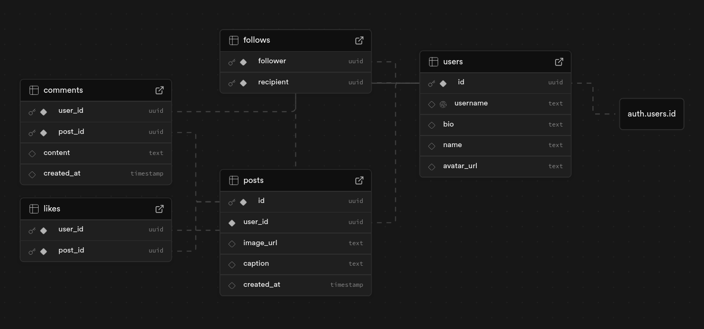

# 📸 InstaClone – A Minimal Instagram Clone Built with Next.js, JavaScript, TypeScript, and Supabase

InstaClone is a full-stack Instagram-style web application built using **Next.js**, **JavaScript**, **TypeScript**, and **Supabase**. This project demonstrates modern authentication, real-time database interaction, image uploads, and a sleek user interface.

---

## 🔐 Authentication & Email Verification

New users sign up using an email, username, and password. Users are sent prevented from accessing other pages through **Auth-gated Routing** until they verify their email with a **2FA** link sent to them.

<video width="100%" autoplay muted loop playsinline>
  <source src="media/auth-signup.mp4" type="video/mp4">
  Your browser does not support the video tag.
</video>
https://github.com/user-attachments/assets/0c52eb7f-66a9-4cbf-a01c-ee8577ff532f

---

## 🏠 Home Feed

Once logged in, users are greeted by the home page where they can view a feed containing all public posts from all users, ordered from newest to oldest. These unique posts can also be visited through the use of **Dynamically Routed URLs** where users are also free to leave their peers a like or an encouraging comment!

<video width="100%" autoplay muted loop playsinline>
  <source src="media/visit-post.mp4" type="video/mp4">
  Your browser does not support the video tag.
</video>
https://github.com/user-attachments/assets/8e3cb592-a741-4b55-a907-fd148390fe1a

---

## 🔍 Explore Users

The Explore page lists all registered users. Clicking a username allows you to navigate to their profile.

<video width="100%" autoplay muted loop playsinline>
  <source src="media/explore-users.mp4" type="video/mp4">
  Your browser does not support the video tag.
</video>
https://github.com/user-attachments/assets/702ea84a-3a8e-4da2-83cc-0d034231dce5

---

## 👤 Profile Page

Profiles include:
- Profile Picture
- Username, Name, and Bio
- Working Follow Button
- Posts, Follower, & Following Counts(can view what users they're following/followed by)
- User posts (gallery view)

<video width="100%" autoplay muted loop playsinline>
  <source src="media/profile-view.mp4" type="video/mp4">
  Your browser does not support the video tag.
</video>
https://github.com/user-attachments/assets/e6907f5c-a559-4d7e-b377-1152a7d90839

---

## ➕ Create Post

Users can upload an image and write a caption to create a new post. Posts appear in the feed and on their profile.

<video width="100%" autoplay muted loop playsinline>
  <source src="media/create-post.mp4" type="video/mp4">
  Your browser does not support the video tag.
</video>
https://github.com/user-attachments/assets/eeb7633f-2f21-490b-a6c4-3e3e8a133602

---

## ✏️ Edit Profile

Users can also update their profile picture and biography directly from their own profile page.

<video width="100%" autoplay muted loop playsinline>
  <source src="media/edit-profile.mp4" type="video/mp4">
  Your browser does not support the video tag.
</video>
https://github.com/user-attachments/assets/99a5933f-650f-4624-962e-bb03a100e16d

---

## 🚪 Logout

Clicking the logout button ends the session and redirects the user to the login screen.

<video width="100%" autoplay muted loop playsinline>
  <source src="media/logout.mp4" type="video/mp4">
  Your browser does not support the video tag.
</video>
https://github.com/user-attachments/assets/99c26161-50e7-4300-95c6-ba5976f8c859

---

## 🗄️ Supabase Configuration

  

---

## 🛠️ Tech Stack

- **Frontend**: [Next.js](https://nextjs.org/), [Node.js](https://nodejs.org/en), [JavaScript], and [TypeScript](https://www.typescriptlang.org/)
- **Backend/Auth**: [Supabase](https://supabase.com/)
- **Styling**: [Tailwind CSS](https://tailwindcss.com/)
- **Image Uploads**: Supabase Storage
